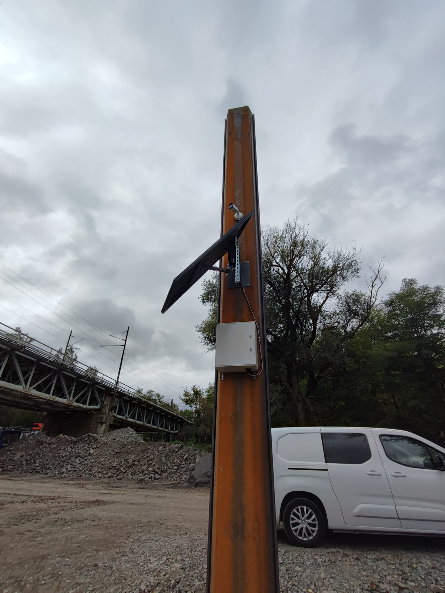
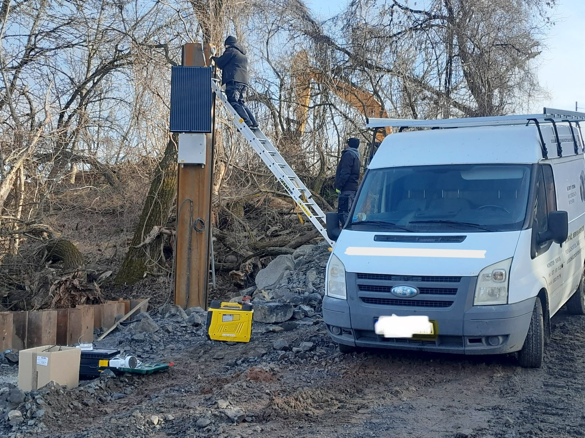
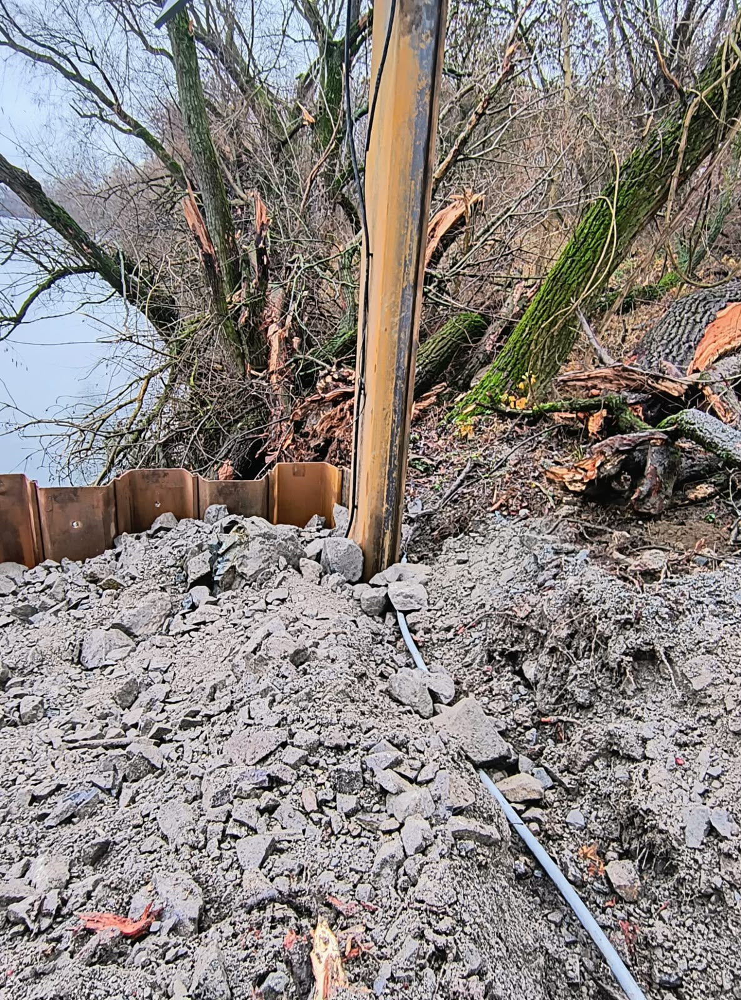
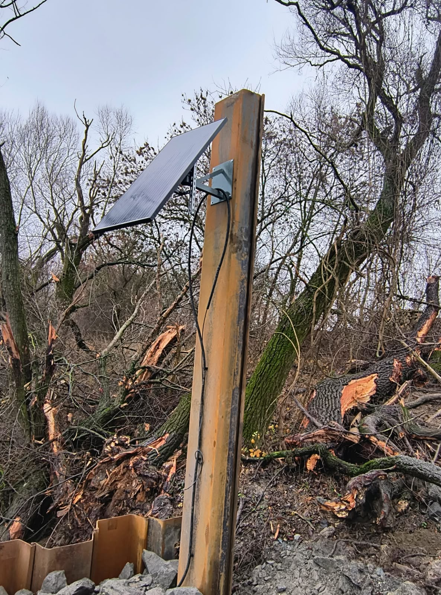
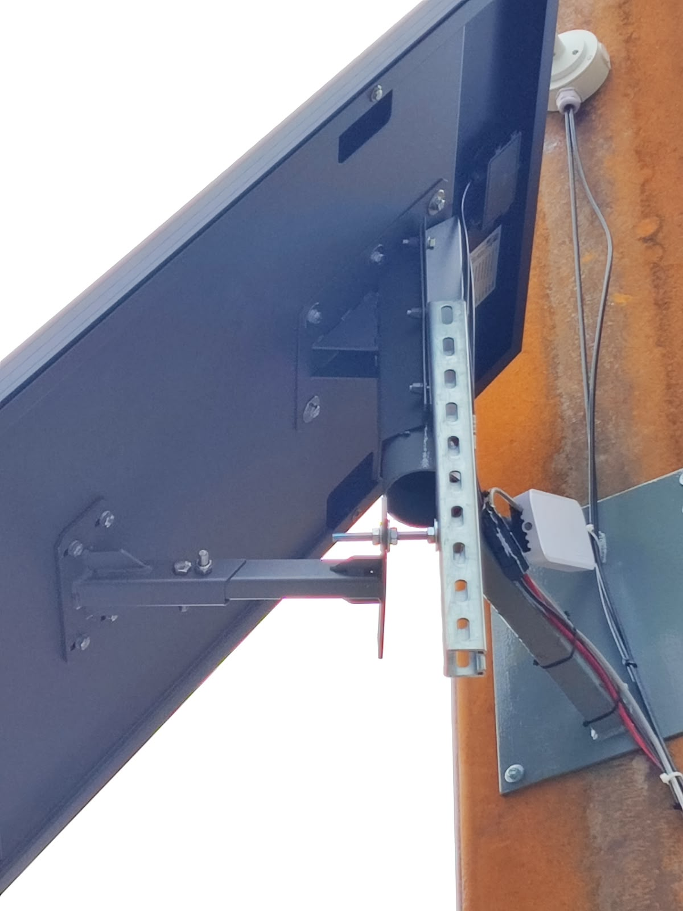

Kamerový dohľad staveniska – autonómny kamerový bod

Cieľom projektu bolo zabezpečiť kamerový dohľad nad priebehom rekonštrukcie mosta a okolitým staveniskom, so zameraním na pohyb a činnosť ťažkej stavebnej techniky, najmä bagrov a ďalších mechanizmov.
Keďže sa kamerový bod nachádzal mimo dostupnej elektrickej siete, bolo potrebné navrhnúť autonómne napájanie pomocou fotovoltaického systému a batérie.

**Technické riešenie**
Kamerový bod pozostával z dvoch IP kamier, sieťovej infraštruktúry a autonómneho napájania.

**Použité komponenty:**

☀️ Solárna fotovoltaická sada 12 V / 160 W
📷 2× Dahua IPC-UFW3459T-ZAS-IL-27135, 4 Mpx IP kamera
🌐 PoE switch
📡 MikroTik router
🔋 12 V / 100 Ah batéria
💾 2× pamäťová karta 128 GB – lokálny záznam v jednotlivých kamerách

**Napájanie**
Kamerový bod bol pôvodne navrhnutý ako autonómny systém napájaný zo solárneho panelu a 12 V / 100 Ah batérie.
Pri návrhu sa počítalo s približne tromi dňami bez dostatočného slnečného žiarenia.
Keďže bol systém inštalovaný počas jesenného a zimného obdobia, reálne poveternostné podmienky boli náročnejšie. Následne nastalo približne týždeň obdobia bez dostatočného slnečného žiarenia, počas ktorého fotovoltaický panel nedokázal batériu dostatočne dobíjať.

Pre zabezpečenie ďalšej prevádzky bolo preto riešenie dodatočne upravené. Bol doplnený:

⚡ zdroj 230 V / 12 V
🔌 stýkač
🔋 možnosť dobíjania batérie z dieselového agregátu

Tým vznikla možnosť záložného dobíjania batérie počas dlhšieho obdobia bez slnečného žiarenia.

**Kamerový dohľad a záznam**
Na monitorovanie boli použité dve IP kamery Dahua, ktoré boli umiestnené tak, aby pokrývali priestor mosta, breh vody a priľahlé stavenisko.
Nebolo použité klasické NVR. Záznam bol ukladaný priamo na pamäťové karty v jednotlivých kamerách, pričom každá kamera mala vlastnú 128 GB kartu.
Pre vzdialený dohľad bol systém pripojený prostredníctvom MikroTik routera. Živý obraz bolo možné sledovať na diaľku prostredníctvom aplikácie DMSS.

**Časozberné video**
Okrem bežného kamerového záznamu bolo požiadavkou aj vytvorenie podkladov pre časozberné video dokumentujúce priebeh rekonštrukcie mosta.
Každá kamera preto v pravidelnom intervale jednej minúty vytvárala samostatnú snímku, ktorá bola následne ukladaná do cloudového priečinka.
Po dokončení stavebných prác bolo možné tieto snímky použiť na vytvorenie časozberného videa celého priebehu stavby.

**Moja úloha**
Na projekte som zabezpečoval kompletnú montáž a uvedenie kamerového bodu do prevádzky podľa navrhnutého technického riešenia.

Moja práca zahŕňala:
🔧 montáž a osadenie rozvádzača,
⚡ zapojenie a kompletizáciu rozvádzača,
☀️ montáž fotovoltaického systému,
🔋 zapojenie batérie a napájacej časti,
📷 montáž a nastavenie IP kamier,
🌐 montáž a zapojenie PoE switcha a MikroTik routera,
🔌 realizáciu kabeláže a jednotlivých prepojení,
⚙️ konfiguráciu kamerového systému a sieťových prvkov,
📱 nastavenie vzdialeného prístupu cez DMSS,
💾 nastavenie lokálneho záznamu na pamäťové karty,
☁️ nastavenie pravidelného odosielania snímok do cloudového úložiska,
🛠️ dodatočnú úpravu napájania po skúsenosti s nedostatkom slnečného žiarenia,
🔌 zapojenie možnosti dobíjania batérie pomocou 230 V zdroja a dieselového agregátu,
🧪 testovanie a uvedenie celého systému do prevádzky.

**Návrh samotného technického riešenia nebol mojou úlohou.**

## Fotografie

### Kamerový bod pri moste

### Celkový pohľad na kamerový bod

### Solárny panel a kamera

### Montáž

### Osadenie a ukotvenie stožiara

### Panel a kabeláž

### Panel a router

